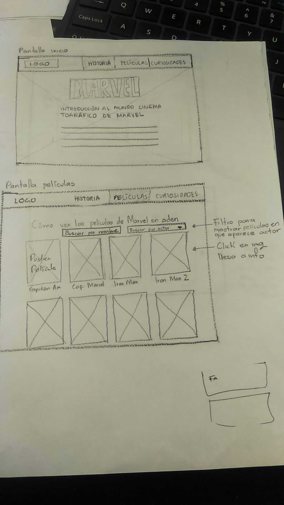

# "Hackathon" de final de _Common Core_, películas

# MarvelPedia

### La productora Marvel Studios lleva produciendo películas del universo Marvel de superhéroes desde 2008. La primera película fue Iron Man, y desde entonces no han parado de estrenar películas. Todas estas películas tienen continuidad entre ellas, están enlazadas, y los sucesos que ocurren en ellas tienen repercusión en las siguientes. Esto se conoce como Universo Cinematográfico de Marvel (MCU por sus siglas en inglés).

### Por lo tanto nuestro mercado meta son hombres y mujeres de 15 a 40 años que esten interesados en adentrarse en el mundo de marvel. Así como personas que cuenten con dispositivos,internet, y hablen inglés.

### El objetivo de MarvelPedia es que el usuario conozca el universo cinematrografico de Marvel ordenando cronológicamente las películas y dando opciones, una de ellas es el filtrado por actor, donde podrá visualizar las películas en donde aparece su actor preferido; Otra opción que el usuario encontrará es: al hacer click sobre la película deseada se mostrará información básica así como el trailer de la misma, el ranking, los comentarios y la sugerencia de la plataforma donde puede encontrarla.

### También se mostrará en una pantalla la linea del tiempo con la información general del como surge Marvel, de esta forma el usuario tendrá un contexto mas definido.

### Un plus que resulta de gran importancia y curiosidad para el usuario, es la evolución de los trajes de los super héroes  con respecto a los años y las diferentes películas.

---
## Prototipo de baja fidelidad

- Para desktop

- Para celular

---
## Prototipo de alta fidelidad

- [Para desktop](https://www.figma.com/file/Lgq0bPe2k9Sf3fNqz2JAVMrO/MarvelPEDIA-desktop)

- [Para celular](https://www.figma.com/file/SjLjy69Qh62TuJAvXTe7VTMl/MarvelPEDIA-responsive-mobile)
---
## Trabajo en equipo

### *Iris y Lucero:
- Entrevistas para el estudio de mercado a diferentes usuarios.
- Planeación del proyecto e historias de usuario.
- Prototipo de baja fidelidad (Sketch). 
- Prototipo de alta fidelidad en figma.
- Desarrollo de pantallas (Home, movies, super suit, story) en html, css y js.

### *Mel e Itzel:
- Entrevistas para el estudio de mercado a diferentes usuarios.
- Planeación del proyecto e historias de usuario.
- Prototipo de baja fidelidad (Sketch). 
- Prototipo de alta fidelidad en figma.
- Desarrollo de funcionalidad en js de orden de las peliculas y filtro por actor.
- Desarrollo funcional del modal para mostrar pantalla con información básica de la película, trailer, ranking y comentarios.

--- 

## Índice

- [Preámbulo](#preámbulo)
- [Resumen del proyecto](#resumen-del-proyecto)
- [Consideraciones generales](#consideraciones-generales)
- [Objetivos de aprendizaje](#objetivos-de-aprendizaje)
- [Parte obligatoria](#parte-obligatoria)
- [Consideraciones técnicas](#consideraciones-técnicas)

---

## Preámbulo

Con la aparición de plataformas para ver películas en la nube, como Netflix o
Amazon Prime Video, ver películas desde donde estés, comiendo lo que quieras
(sin tener que pagar precios ridículos por palomitas), parando si es necesario, teniendo acceso a una cantidad
abrumadora de películas... ha cambiado la experiencia del usuario
y modificado el mercado de las películas a nivel global.

## Resumen del proyecto

Durante estos días crearás el producto que quieras alrededor del mundo
de las películas. Puede ser un sitio que hable de las mejores películas
latinoamericanas, uno que recomiende las películas recién estrenadas en algún servicio de streaming, uno de recomendaciones de películas de terror,
comedia ... o... ¡lo que quieran!

## Consideraciones generales

- Este proyecto se debe resolver en equipos de hasta 4 personas y uno de 3.
- Usa la API de [OMDB](http://www.omdbapi.com/) (The Open Movie Database).
- Tiempo para completar el reto: 3 días.
- Habrán dos presentaciones, una a la mitad de la _hackathon_ y otra al final.

## Objetivos de aprendizaje

- Enfrentarte a un reto de corta duración en el que pongas
  en práctica todo lo aprendido hasta ahora.
- Que sigas desarrollando tus habilidades de trabajo en equipo. Mientras más
  personas en un equipo de trabajo, mayor complejidad para: tener un
  entendimiento común, seguir el flujo de trabajo, buscar consensos, etc.

## Parte Obligatoria

- Todo el planeamiento del trabajo deberá ser detallado en un repositorio único
  por _squad_ en el que se presente el _planning_, el _research_, los _sketches_
  y las inspiraciones utilizadas para definir el producto.
- Además, deberás detallar en el archivo _readme_, qué hizo cada una en el
  proyecto.
- El producto deberá presentarse publicado en github pages.

## Consideraciones técnicas

- El diseño visual de los componentes es de libre elección.
- Pueden usar algún framework de css si así lo deciden.

## Sobre las presentaciones

- Cada squad tendrá 5 minutos para presentar y 5 minutos para recibir preguntas.

- Las personas que presentan en la primera presentación no deben ser las mismas de la presentación final.
